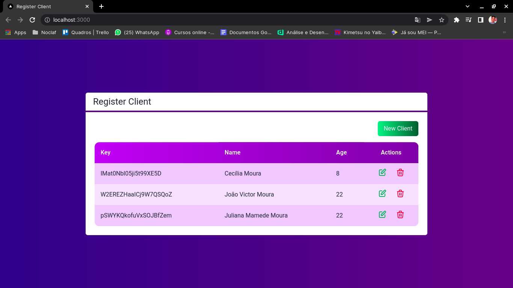

# Pokedex 📱

<p>
  🇺🇸 Study project with Next.js, React, Tailwind TypeScript and Firebase!
</p>

<br/>

<p>
  🇧🇷 Projeto de estudos com Next.js, React, Tailwind TypeScript e Firebase!

</p>


## 🇺🇸 If you want to analyze the project on your machine, follow this step by step. 🇧🇷 Caso você queira analisar o projeto em sua máquina, siga este passo a passo: 😁

<br>

## 🇺🇸 ENG

### Clone😎

```
git clone https://github.com/jovimoura/register-next
```

### Access the folder🤓

```
cd <folder>
```
### Install dependencies🤠
```
npm install
```
### Start application🤩
```
npm run serve
```
### default port:🤗

```
http://localhost:3000/
```

<br>

## 🇧🇷 PT-BR

### Clone o repositório😎

```
git clone https://github.com/jovimoura/register-next
```

### Acesse o diretorio🤓

```
cd <nome-da-pasta>
```
### Instale as dependências🤠
```
npm install
```
### Inicie a aplicação🤩
```
npm run serve
```
### A aplicação, por padrão, fica na porta:🤗

```
http://localhost:3000/
```

## 🇺🇸 Image | 🇧🇷 Imagem do projeto  💻




##  🇺🇸 Tecnologies and Libs | 🇧🇷 Tecnologias e Bibliotecas utilizadas🦉

<ul>
    <li>Next.JS</li>
    <li>React</li>
    <li>Taildwind</li>
    <li>TypeScript</li>
    <li>Firebase</li>
</ul>

##  🇧🇷 Feito por / 🇺🇸 Made by:

### João Victor dos Santos Moura
### E-mail: joaovictors.mouraa@gmail.com
### Linkedin: https://www.linkedin.com/in/jovimoura10/
